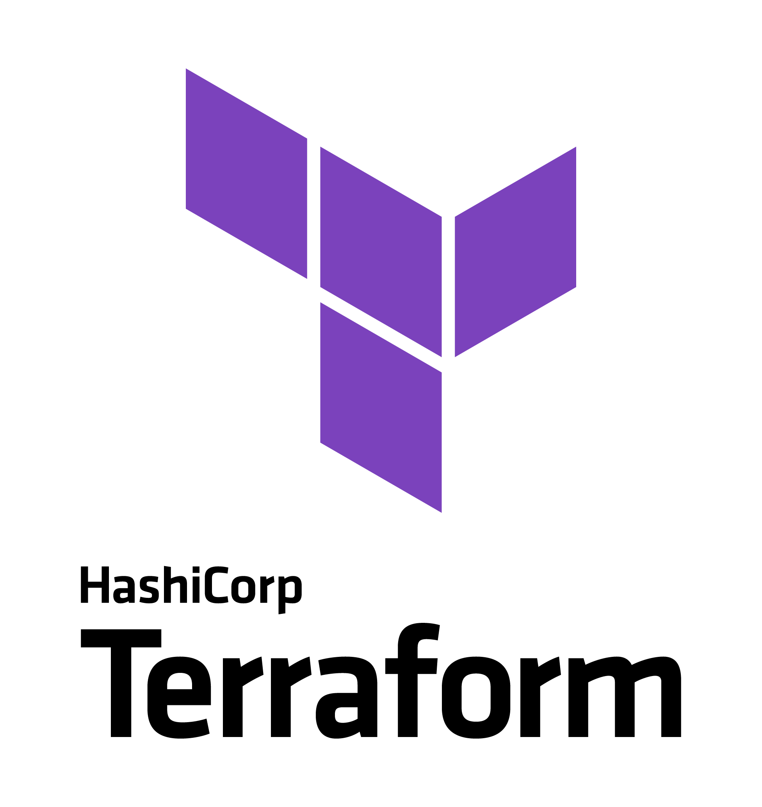
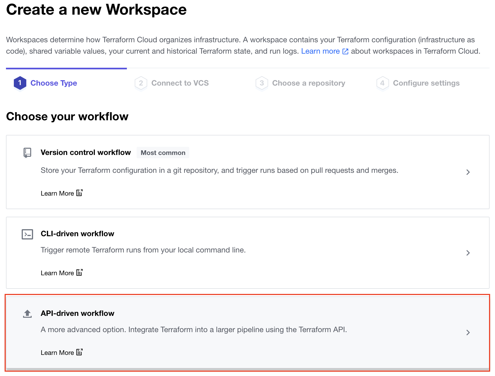

# Infrastructure - DevOps : Github X Terraform
<!-- ------------------------ -->
## Overview 


Ce guide fournira des instructions étape par étape pour créer un simple pipeline CI / CD pour Snowflake avec des actions GitHub et Terraform.J'espère que cela vous fournira suffisamment de détails pour vous permettre de commencer votre voyage DevOps avec Snowflake, Github Actions et Terraform.


> 
> 
>  **Tip** - Pour une introduction plus complète à l'utilisation de Terraform avec Snowflake, veuillez vérifier [Terraforming Snowflake](https://quickstarts.snowflake.com/guide/terraforming_snowflake/index.html?index=..%2F..index#0).

Commençons par un bref aperçu de Github et Terraform.

### Ce dont on aura besoin

Vous aurez besoin des choses suivantes avant de commencer:


  1. **A Snowflake Account.**
  2. **Un utilisateur de Snow créé avec des autorisations appropriées.** Cet utilisateur aura besoin d'une autorisation pour créer des bases de données.
1. Github
  1. **A GitHub Account.** 
  2. **A GitHub Repository.** 
2. Terraform Cloud
  1. **A Terraform Cloud Account.** [Create an account](https://app.terraform.io/signup/account) page to get started.
3. **Integrated Development Environment (IDE)**


## Apercu de Terraform 



### Terraform
[Terraform](https://www.terraform.io/) est une infrastructure open source en tant qu'outil de code (IAC) créé par [HashiCorp](https://www.hashicorp.com/)


### Terraform Cloud
Terraform Cloud offre de services gérés qui élimine le besoin d'outillage et de documentation inutiles pour utiliser Terraform en Production.


<!-- ------------------------ -->
## Setup and Configure Terraform Cloud

Vous devrez avoir un compte Cloud Terraform pour cette demo.Si vous n'avez pas déjà de compte Terraform Cloud, vous pouvez créer gratuitement. [Create an account](https://app.terraform.io/signup/account) 


### Créer un nouveau Workspace
Selectionne "API-driven workflow".



Sur la deuxième page, où il demande le "Nom de Workspace", entrez `GH-Actions-Demo`, puis cliquez sur le bouton" Créer un espace de travail "en bas de la page.

### Setup Environment Variables
Pour que Terraform Cloud puisse vous connecter à votre compte Snowflake, vous devrez stocker les paramètres des variables d'environnement.Heureusement, Terraform Cloud le rend facile.À partir de votre nouvelle page d'accueil de l'espace de travail, cliquez sur l'onglet "Variables".Ensuite, pour chaque variable répertoriée ci-dessous, cliquez sur le bouton "+ Ajouter la variable" (sous la section "Variables d'environnement") et entrez le nom ci-dessous avec la valeur appropriée (ajustement le cas échéant).

<table>
    <thead>
        <tr>
            <th>Variable key</th>
            <th>Variable value</th>
            <th>Sensitive?</th>
        </tr>
    </thead>
    <tbody>
        <tr>
            <td>SNOWFLAKE_ACCOUNT</td>
            <td>x******</td>
            <td>No</td>
        </tr>
        <tr>
            <td>SNOWFLAKE_REGION</td>
            <td>east-us-2.azure</td>
            <td>No</td>
        </tr>
        <tr>
            <td>SNOWFLAKE_USER</td>
            <td>DEMO_USER</td>
            <td>No</td>
        </tr>
        <tr>
            <td>SNOWFLAKE_PASSWORD</td>
            <td>*****</td>
            <td>Yes</td>
        </tr>
    </tbody>
</table>


When you’re finished adding all the secrets, the page should look like this:


### Create an API Token
La dernière chose que nous devons faire dans Terraform Cloud est de créer un jeton API afin que les actions GitHub puissent s'authentifier en toute sécurité avec Terraform Cloud.

Cliquez sur le bouton "Créer un  API token", donnez à votre jeton un "Description" (comme `GitHub Actions`), puis cliquez sur le bouton" Créer un jeton API ".Portez une attention particulière sur l'écran suivant.Vous devez enregistrer le jeton API car une fois que vous avez cliqué sur le bouton "Done", le jeton **ne sera plus affiché**.Une fois que vous avez enregistré le jeton, cliquez sur le bouton "Terminé".

<!-- ------------------------ -->
## Create the Actions Workflow


### Create Actions Secrets
Les Actions Secrets dans GitHub sont utilisés pour stocker en toute sécurité les valeurs / variables qui seront utilisées dans vos pipelines CI / CD.Dans cette étape, nous créerons un secret pour stocker le jeton API dans Terraform Cloud.


### Action Workflows
Les workflows d'action représentent des pipelines automatisés, ce qui inclut à la fois des pipelines de construction et de libération.Ils sont définis comme des fichiers YAML et stockés dans votre référentiel dans un répertoire appelé `.github / workflows`.Dans cette étape, nous créerons un flux de travail de déploiement qui exécutera Terraform et déploiera des modifications de notre compte SnowFlake.


```yaml
name: "Snowflake Terraform Demo Workflow"

on:
  push:
    branches:
      - main

jobs:
  snowflake-terraform-demo:
    name: "Snowflake Terraform Demo Job"
    runs-on: ubuntu-latest
    steps:
      - name: Checkout
        uses: actions/checkout@v2

      - name: Setup Terraform
        uses: hashicorp/setup-terraform@v1
        with:
          cli_config_credentials_token: ${{ secrets.TF_API_TOKEN }}

      - name: Terraform Format
        id: fmt
        run: terraform fmt -check

      - name: Terraform Init
        id: init
        run: terraform init

      - name: Terraform Validate
        id: validate
        run: terraform validate -no-color

      - name: Terraform Apply
        id: apply
        run: terraform apply -auto-approve
```


Quelques choses à souligner de la définition du pipeline YAML:

- La définition `ON:` configure le pipeline pour s'exécuter automatiquement lorsqu'un changement est poussé sur la branche «Main» du référentiel.Ainsi, tout changement commis dans une succursale différente ne déclenchera pas automatiquement le workflow à s'exécuter.
- Veuillez noter que si vous réutilisez un référentiel GitHub existant, il pourrait conserver l'ancienne dénomination de la branche master/main .Si oui, veuillez mettre à jour le YAML ci-dessus (voir la section `ON:`).
- Nous utilisons Linux hébergé par GitHub par défaut pour exécuter le pipeline.


<!-- ------------------------ -->
## Create Your First Database Migration

Ouvrez votre GitHub cloné dans votre IDE  et créez un nouveau fichier dans la racine nommée `main.tf` avec le contenu suivant.

```terraform
terraform {
  required_providers {
    snowflake = {
      source  = "chanzuckerberg/snowflake"
      version = "0.25.17"
    }
  }

  backend "remote" {
    organization = "my-organization-name"

    workspaces {
      name = "gh-actions-demo"
    }
  }
}

provider "snowflake" {
}

resource "snowflake_database" "demo_db" {
  name    = "DEMO_DB"
  comment = "Database for Snowflake Terraform demo"
}
```

En poussant ce commit dans notre repo GitHub, le nouveau workflow que nous avons créé à l'étape précédente s'exécutera automatiquement.

<!-- ------------------------ -->
## Confirm Changes Deployed to Snowflake

À présent, votre première migration de base de données aurait dû être déployée avec succès sur Snowflake, et vous devriez maintenant avoir une base de données `Demo_DB` disponible.Il y a quelques endroits différents que vous devriez vérifier pour confirmer que tout s'est déployé avec succès, ou pour vous aider à déboguer dans le cas où une erreur se produirait.

### Snowflake Objects

Connectez-vous à votre compte Snowflake et vous devriez voir votre nouvelle base de données `Demo_DB`!En plus, vous pouvez consulter les requêtes qui ont été exécutées par Terraform en cliquant sur l'onglet "History" en haut de la fenêtre.

<!-- ------------------------ -->
## Create Your Second Database Migration

Maintenant que nous avons réussi à déployer notre premier changement à Snowflake, il est temps d'en faire un deuxième.Cette fois, nous ajouterons un schéma au «Demo_DB» et le ferons déployer via notre pipeline automatisé.

Ouvrez votre référentiel cloné dans votre IDE préféré et modifiez le fichier `main.tf` en ajoutant les lignes suivantes pour terminer le fichier:

```terraform
resource "snowflake_schema" "demo_schema" {
  database = snowflake_database.demo_db.name
  name     = "DEMO_SCHEMA"
  comment  = "Schema for Snowflake Terraform demo"
}
```

Ensuite, commit les modifications et push dans votre repo GitHub.En raison du trigger d'intégration continue que nous avons créé dans la définition YAML, votre flux de travail aurait dû avoir automatiquement démarré une nouvelle exécution.Basculez à votre github et ouvrez la page "Actions".À partir de là, ouvrez l'exécution du flux de travail le plus récent et affichez les journaux.Parcourez les mêmes étapes que vous avez faites dans la section précédente pour confirmer que le nouveau `Demo_schema` a été déployé avec succès.

Felicitations, Vous avez maintenant un pipeline CI / CD fonctionnel avec Terraform et Snowflake!
<!-- ------------------------ -->
##  Advanced Actions Workflow

Dans les sections précédentes, nous avons créé et testé un workflow GitHub Actions simples avec Terraform.Cette section fournit un flux de travail plus avancé que vous pouvez tester.Celui-ci ajoute la capacité de valider TerraForm et de planifier un changement avant qu'il ne soit réellement déployé.Ce pipeline ajoute des déclencheurs CI qui le font fonctionner lorsqu'une PULL REQUEST (PR) est créée / mise à jour.Au cours de ce processus, il exécutera un `plan Terraform` et collera les résultats du PR lui-même pour une revue facile.

```terraform
name: "Snowflake Terraform Demo Workflow"

on:
  push:
    branches:
      - main
  pull_request:

jobs:
  snowflake-terraform-demo:
    name: "Snowflake Terraform Demo Job"
    runs-on: ubuntu-latest
    steps:
      - name: Checkout
        uses: actions/checkout@v2

      - name: Setup Terraform
        uses: hashicorp/setup-terraform@v1
        with:
          cli_config_credentials_token: ${{ secrets.TF_API_TOKEN }}

      - name: Terraform Format
        id: fmt
        run: terraform fmt -check

      - name: Terraform Init
        id: init
        run: terraform init

      - name: Terraform Validate
        id: validate
        run: terraform validate -no-color

      - name: Terraform Plan
        id: plan
        if: github.event_name == 'pull_request'
        run: terraform plan -no-color
        continue-on-error: true

      - uses: actions/github-script@0.9.0
        if: github.event_name == 'pull_request'
        env:
          PLAN: "terraform\n${{ steps.plan.outputs.stdout }}"
        with:
          github-token: ${{ secrets.GITHUB_TOKEN }}
          script: |
            const output = `#### Terraform Format and Style 🖌\`${{ steps.fmt.outcome }}\`
            #### Terraform Initialization ⚙️\`${{ steps.init.outcome }}\`
            #### Terraform Validation 🤖\`${{ steps.validate.outcome }}\`
            #### Terraform Plan 📖\`${{ steps.plan.outcome }}\`
            
            <details><summary>Show Plan</summary>
            
            \`\`\`\n
            ${process.env.PLAN}
            \`\`\`
            
            </details>
            
            *Pusher: @${{ github.actor }}, Action: \`${{ github.event_name }}\`, Working Directory: \`${{ env.tf_actions_working_dir }}\`, Workflow: \`${{ github.workflow }}\`*`;
            
            github.issues.createComment({
              issue_number: context.issue.number,
              owner: context.repo.owner,
              repo: context.repo.repo,
              body: output
            })

      - name: Terraform Plan Status
        if: steps.plan.outcome == 'failure'
        run: exit 1

      - name: Terraform Apply
        if: github.ref == 'refs/heads/main' && github.event_name == 'push'
        run: terraform apply -auto-approve
```


<!-- ------------------------ -->
## Authors

* M'hamed Issam ED-DAOU
* Yassine DEHBI
